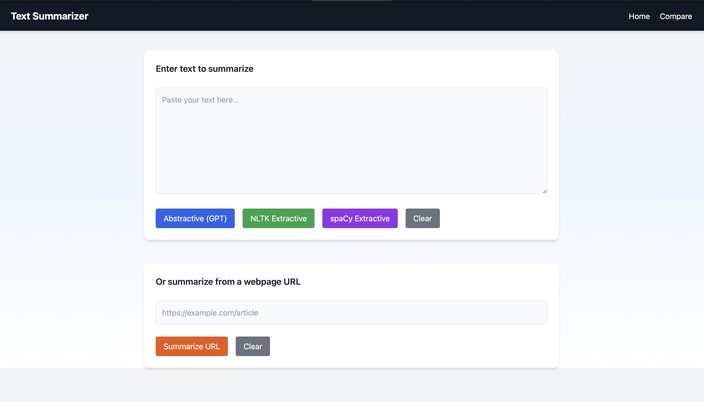
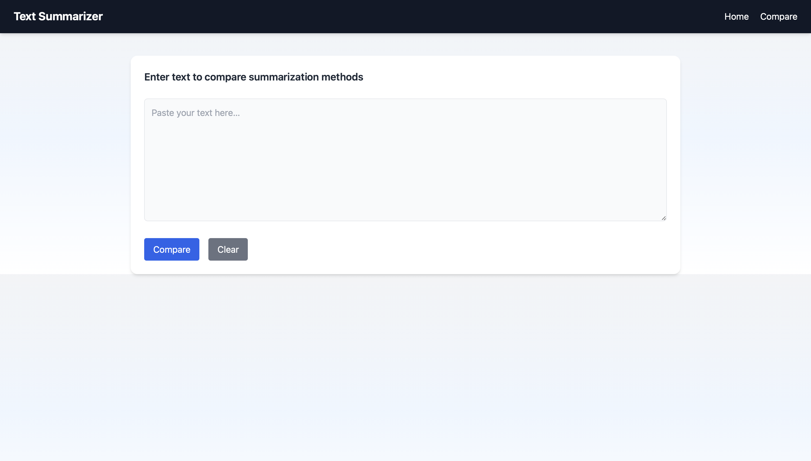
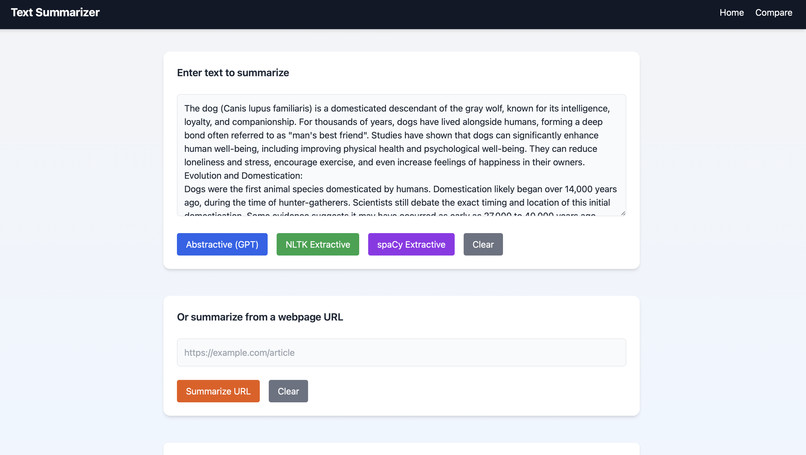
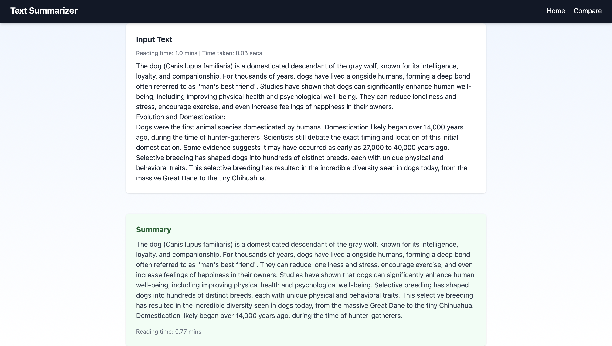
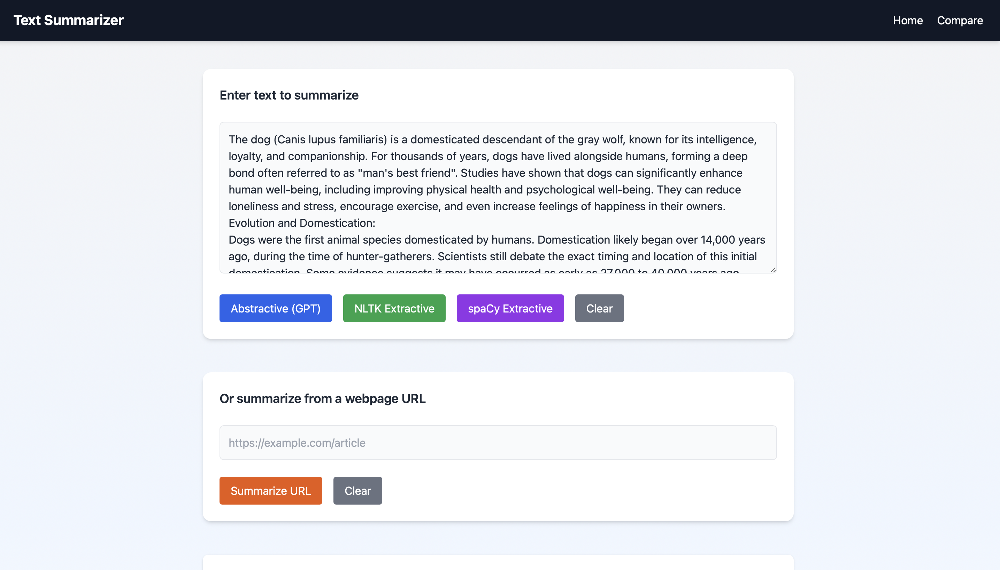
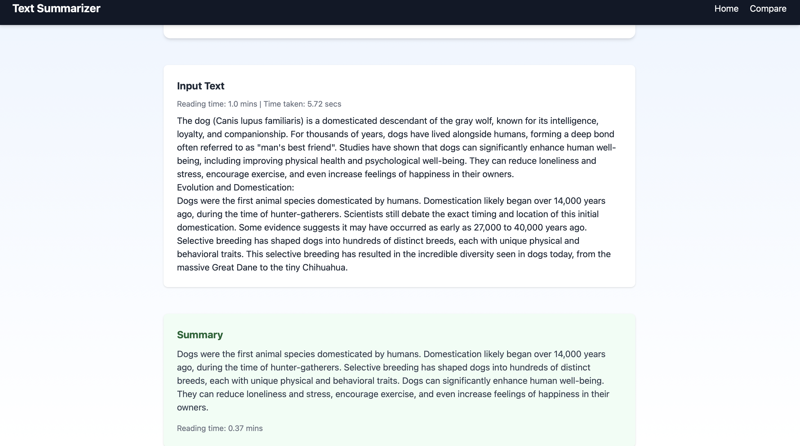
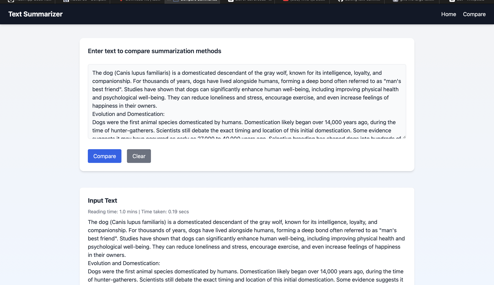
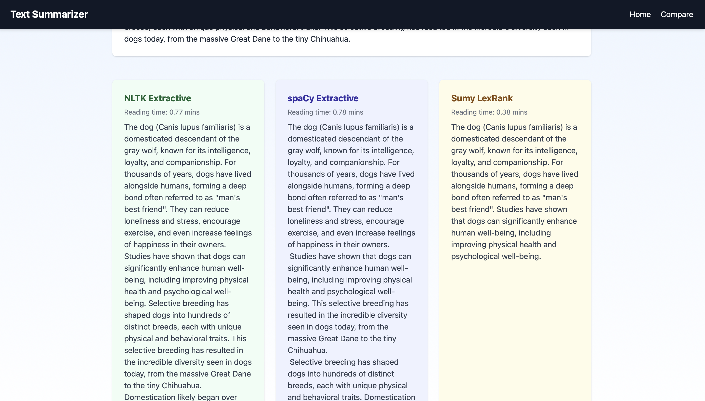

# 🧠 Text Summarizer Web App

This is a Flask-based web application that allows users to generate **abstractive** and **extractive** summaries from either raw text input or a public webpage URL.

## ✨ Features

- 📝 Summarize raw input text using:
  - **Abstractive (GPT-style)** via Hugging Face BART (`facebook/bart-large-cnn`)
  - **Extractive summarization** using NLTK, spaCy, or Sumy LexRank
- 🌐 Summarize content directly from any **public webpage URL**
- 🆚 Compare output across multiple extractive methods
- 🧮 Displays estimated reading time and processing time
- 🌈 Built with Tailwind CSS for a responsive and modern UI
- 🧼 Includes **Clear** buttons and smooth user experience enhancements

---

## 🛠️ Technologies Used

- **Backend:** Flask (Python)
- **NLP Models:** 
  - Abstractive: `facebook/bart-large-cnn` (via Hugging Face Transformers)
  - Extractive: NLTK, spaCy, Sumy LexRank
- **Frontend:** Tailwind CSS
- **Parsing:** BeautifulSoup (for scraping webpage content)

---

## 🚀 Getting Started

### ✅ Prerequisites

Make sure you have Python 3.7+ and `pip` installed.

### 🔧 Installation

1. **Clone the repo:**

```bash
git clone https://github.com/your-username/text-summarizer-app.git
cd text-summarizer-app
```

text-summarizer-app/
│
├── app.py                        # Main Flask app
├── huggingface_summarization.py # Abstractive summary logic (BART)
├── nltk_summarization.py        # Extractive summarizer using NLTK
├── spacy_summarization.py       # Extractive summarizer using spaCy
├── templates/
│   ├── index.html               # Homepage UI
│   └── compare_summary.html     # Comparison UI
├── static/
│   └── style.css                # Custom CSS
├── requirements.txt             # Required Python packages
└── README.md                    # This file


## 📸 Screenshots

You can summarize content by either:

- ✍️ Entering raw **text** into the text box, or  
- 🌐 Providing a **URL** to a public article or webpage.

Then, click on the appropriate button (Abstractive, NLTK, spaCy, or URL Summarize) to generate your summary.  
The result, along with reading time and processing time, will be shown below the input.

### 🏠 Home Page


### 📊 Compare Page


### 📝 Text Input Summarization- Extractive




### 📝 Text Input Summarization- Abstractive





### 🔍 Compare Summaries




